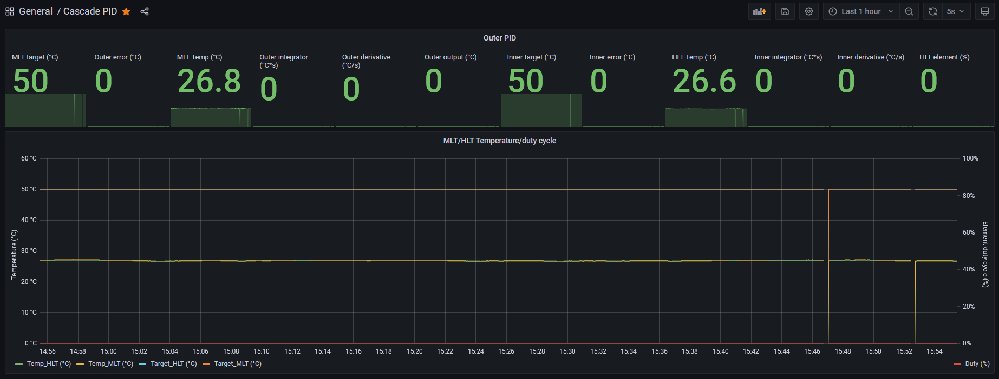

<h1>brewpanel</h1>
<h2>Formerly known as brew2</h2>
<h3>Description</h3>

This is a dashboard for brewery control, built using [Node-RED](https://github.com/node-red/node-red) running on a Raspberry Pi.
The goal is to create a manual control panel, inspired by [The Electric Brewery](https://shop.theelectricbrewery.com/), but with the flexibility and capabilities of a Node-RED backend.

Massive thanks to @jangevaare for his work - without it I would never have been able to get this working!
This fork have no safety to prevent you from firing the elements without running pumps, or both elements at once, since I don't need it in my setup - but if you do, please take a look at the original [project](https://github.com/jangevaare/brew2).

This dashboard has been modified for a three vessel brewery with two pumps to perform recirculating, full volume mashes. Since it's built in Node-RED, it's fairly strightforward to adapt it for your specific needs - but expect a fairly steep learning curve if you've never done much like it before (speaking out of experience ;-) ). 

You are free to use my work in whichever way you like, understanding that I accept no liability relating to its use. Please read the license provided. 

<h3>Features</h3>

* Cascade PID temperature control of mash (see below for details)
* Mash PID with output limiting functionality (to protect agaisnt chaotic behaviour and/or scorching of wort in RIMS breweries)
* PID temperature control for the HLT if preparing water for other use than mashing (sous vide comes to mind)
* Manual control option for the boil kettle to prevent boil overs
* Integrator windup elimination method implemented in all PID algorithms
* Option of logging of temperature, output, as well as PID calculations (useful for PID tuning and analysing PID behaviour) using [Prometheus](https://prometheus.io/) and [Grafana](https://grafana.com/)
* Looks nice

<h4>Cascade PID</h4>

The Cascade PID algorithm I've implemented in this project is used to dynamically set the temperature Δ between the mash set point and the HLT (containing HERMS-coil) target temperature (outer). A second PID (inner) is then used to control the HLT heater to this dynamic temperature target. Some of the results of this are as follows:

* During temperature ramps in a step mash, a relatively large temperature Δ will minimize the transition time during mash steps.
* For brewers in non-climate controlled environments, a larger temperature Δ will be used on colder brew days to counter the heightened heat loss in the mash recirculation process, in comparison to warmer brew days.

The temperature Δ range is set to some limits, with the default being [-2°C, 8°C]. The inclusion of a negative temperature delta in this range improves correction abilities for slight overshooting in the mash temperature.

While it is preferred to have accurately calibrated temperature sensors, this cascade PID algorithm also implicitly accounts for calibration differences between mash and RIMS heater temperature sensors should they exist. The mash temperature sensor is the most important one for accuracy.

Tuning may be required. In a HERMS brewery it is very important to circulate HLT water for effective heat exchange, and to minimize stratification (which will sometimes cause signficant lag in temperature control loop of the HLT).

If you do not wish to use the Cascade PID functionality, set the outer loop coefficients all to 0. The algorithm will function then as a simple single PID using the inner loop coefficients. This is very useful for tuning the Cascade PID as well. I recommend that you run like this until you find a good tuning for the inner loop, you can then start to increase the outer loop coefficients.

<h4>Hardware</h4>

Node-RED is running on a Raspberry Pi (a Zero W will do nicely and is very affordable), acting as a WiFi AP (not necessary if your are in range of your netork) connected via Serial UART to an ESP32 (using a ESP32 devkit from AliExpress). The ESP32 is flashed with [ESPEasy](https://github.com/letscontrolit/ESPEasy) and controls eight 4 digit 7-segment displays (TM1631) showing temperatures, set points and duty cycles.

<h4>Logging</h4>

The Raspberry Pi is running Prometheus scraping the metrics every two seconds. On a separate laptop Grafana connects to Prometheus and shows everything on some nice graphs in realtime. On boot Prometheus is not running, but it can be started from the settings menu.

<h3>Screenshots (v0.5)</h3>

The screenshots included in this repository may not always represent the current version. I will update these screenshots with more significant changes to the dashboard, and will also indicate the version number they represent.

<h3>License</h3>
<b>MIT License</b>

<i>Copyright (c) 2018-2020 Justin Angevaare</i>
<i>Copyright (c) 2021 Kenneth Andersen</i>

Permission is hereby granted, free of charge, to any person obtaining a copy
of this software and associated documentation files (the "Software"), to deal
in the Software without restriction, including without limitation the rights
to use, copy, modify, merge, publish, distribute, sublicense, and/or sell
copies of the Software, and to permit persons to whom the Software is
furnished to do so, subject to the following conditions:

The above copyright notice and this permission notice shall be included in all
copies or substantial portions of the Software.

THE SOFTWARE IS PROVIDED "AS IS", WITHOUT WARRANTY OF ANY KIND, EXPRESS OR
IMPLIED, INCLUDING BUT NOT LIMITED TO THE WARRANTIES OF MERCHANTABILITY,
FITNESS FOR A PARTICULAR PURPOSE AND NONINFRINGEMENT. IN NO EVENT SHALL THE
AUTHORS OR COPYRIGHT HOLDERS BE LIABLE FOR ANY CLAIM, DAMAGES OR OTHER
LIABILITY, WHETHER IN AN ACTION OF CONTRACT, TORT OR OTHERWISE, ARISING FROM,
OUT OF OR IN CONNECTION WITH THE SOFTWARE OR THE USE OR OTHER DEALINGS IN THE
SOFTWARE.
